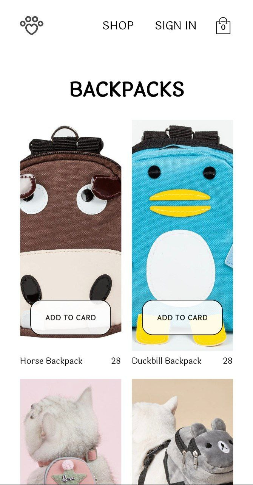

# paWWear


## About
React application of a pet clothing store.

Integrated with the **Firebase** platform, it stores data on products and registered users. Payment functionality is facilitated through **Stripe**.

## Installation
```sh
yarn install

yarn start
```

## Preview


